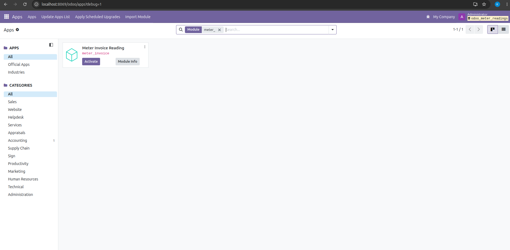
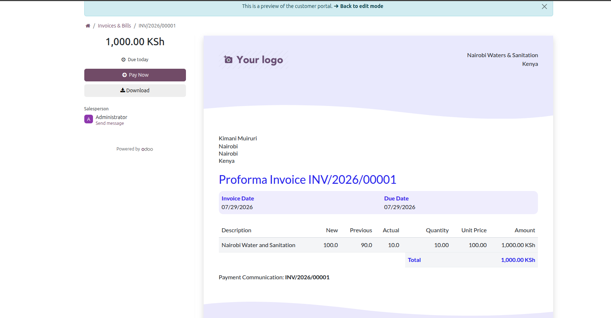
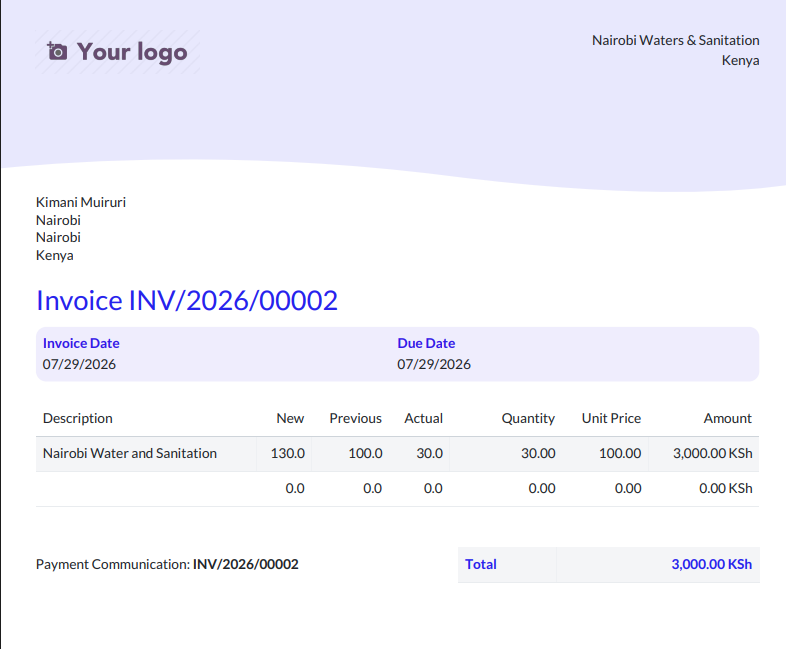

# Meter Invoice Reading

A custom Odoo 19 Accounting module that adds meter based billing to customer invoices by tracking meter readings, calculating consumption, and synchronizing invoice quantities.

## Features

* Adds **Previous Reading**, **New Reading**, and **Actual Reading** to invoice lines.
* Automatically calculates consumption (`Actual Reading = New Reading - Previous Reading`).
* Synchronizes invoice **Quantity** with the calculated consumption.
* Automatically retrieves the previous meter reading from the customer's last posted invoice for the same product.
* Includes meter readings on the printed invoice PDF.
* Prevents negative consumption.

## Requirements

* Odoo 19 Community
* Accounting module installed

## Installation

1. Download or clone this repository.
2. Copy the `meter_invoice` folder into your Odoo custom addons directory.

```
addons/
└── meter_invoice/
```

3. If using Docker on Linux, ensure the addons and odoo_data directories are accessible to the Odoo container:

```bash
sudo chown -R 100:101 addons/
sudo chown -R 100:101 odoo_data/

sudo chmod -R 755 addons/
sudo chmod -R 755 odoo_data/
```

> **Windows/macOS**: No ownership changes are typically required when using Docker Desktop. Ensure the addons directory is shared with Docker and has read/write permissions.


4. Restart the Odoo service.

5. Enable **Developer Mode**.
6. Go to **Apps → Update Apps List**.
7. Search for **Meter Invoice Reading** and install/activate the module.

## Usage

1. Create and post an invoice with meter readings.
2. Create another invoice for the same customer and product.
3. The **Previous Reading** is automatically populated from the previous invoice.
4. **Actual Reading** and **Quantity** are calculated automatically.

## Screenshots

### Invoice Form



### Invoice Example



### Invoice PDF



## Sample Screenshots

### Invoice Module Overview


### Sample Invoice with Meter Readings
Initial invoice with meter readings showing previous and new readings, along with calculated actual consumption.

#### Invoice 1 Preview


#### Invoice 2 PDF Format


